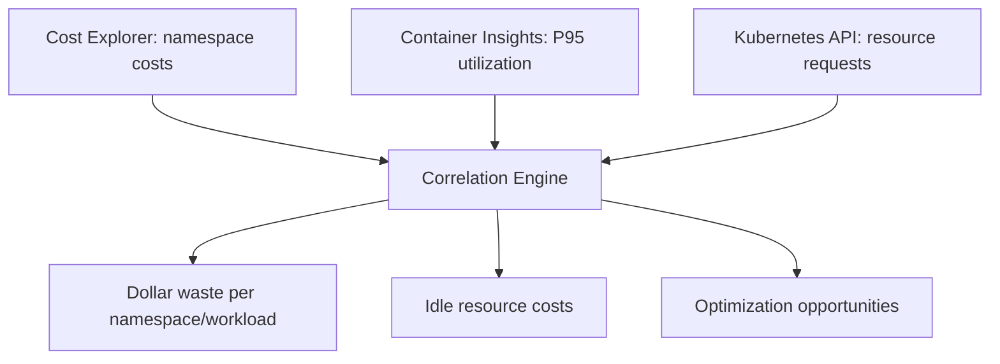

:::info[Source]
This page is generated from [skills/eks-cost-intelligence/references/cost-data-collection.md](https://github.com/aws-samples/sample-apex-skills/blob/main/skills/eks-cost-intelligence/references/cost-data-collection.md). Edit the source, not this page.
:::

# Cost Data Collection

> **Part of:** [eks-cost-intelligence](../)
> **Purpose:** Exact API calls and queries to pull cost and utilization data from Cost Explorer, CloudWatch Container Insights, and the Kubernetes API

---

## Overview

This reference documents the exact API calls needed to collect cost and utilization data from three primary sources. Each query includes both the preferred EKS MCP Server path and the AWS CLI/boto3 fallback path.

**Data sources and what they provide:**

| Source | Data | Required For |
|--------|------|--------------|
| AWS Cost Explorer | Dollar spend, namespace attribution, Savings Plan coverage | Dollar-accurate findings |
| CloudWatch Container Insights | CPU/memory P50/P95, node utilization | Utilization-based waste detection |
| Kubernetes API | Deployments, PVCs, Services, resource requests | Configuration-based analysis |

**Fallback chain:**
1. EKS MCP Server (preferred when available)
2. AWS CLI / boto3 (default fallback)
3. kubectl (for Kubernetes resources when MCP unavailable)
4. CloudWatch Logs Insights (when Container Insights metrics unavailable)

---

## 1. AWS Cost Explorer

### Prerequisites

- Cost Allocation Tags activated in Billing console (`eks:cluster-name`, `kubernetes-namespace`)
- Split Cost Allocation Data enabled for namespace-level attribution
- IAM permission: `ce:GetCostAndUsage`, `ce:GetSavingsPlansCoverage`
- Cost Explorer API is only available in `us-east-1` regardless of cluster region

### 1.1 Total EKS Spend by Service (Last 30 Days)

**Via EKS MCP Server:**
```
get_cloudwatch_metrics(
  cluster_name="<cluster>",
  metric_name="EstimatedCharges",
  namespace="AWS/Billing",
  dimensions={"ServiceName": "Amazon Elastic Kubernetes Service"},
  period=2592000,
  stat="Maximum"
)
```

**Via AWS CLI:**
```bash
aws ce get-cost-and-usage \
  --time-period Start=$(date -d '30 days ago' +%Y-%m-%d),End=$(date +%Y-%m-%d) \
  --granularity MONTHLY \
  --metrics "BlendedCost" "UnblendedCost" "UsageQuantity" \
  --filter '{
    "Tags": {
      "Key": "eks:cluster-name",
      "Values": ["<cluster-name>"]
    }
  }' \
  --group-by Type=DIMENSION,Key=SERVICE \
  --region us-east-1
```

**Via boto3:**
```python
import boto3
from datetime import date, timedelta

ce = boto3.client("ce", region_name="us-east-1")
end = date.today()
start = end - timedelta(days=30)

response = ce.get_cost_and_usage(
    TimePeriod={"Start": str(start), "End": str(end)},
    Granularity="MONTHLY",
    Metrics=["BlendedCost", "UnblendedCost", "UsageQuantity"],
    Filter={
        "Tags": {
            "Key": "eks:cluster-name",
            "Values": ["<cluster-name>"]
        }
    },
    GroupBy=[
        {"Type": "DIMENSION", "Key": "SERVICE"}
    ]
)

# Parse results
for group in response["ResultsByTime"][0]["Groups"]:
    service = group["Keys"][0]
    cost = float(group["Metrics"]["UnblendedCost"]["Amount"])
    print(f"{service}: ${cost:.2f}")
```

**Expected services in results:**
- Amazon Elastic Kubernetes Service (control plane)
- Amazon Elastic Compute Cloud (EC2 nodes)
- Amazon Elastic Block Store (EBS volumes)
- Amazon Elastic Load Balancing (ALB/NLB)
- Amazon CloudWatch (monitoring)
- Amazon VPC (NAT Gateway, data transfer)

---

### 1.2 Namespace-Level Cost Attribution (Split Cost Allocation)

Split Cost Allocation Data distributes shared EC2 and EKS costs to individual pods/namespaces based on resource requests. Must be enabled in Cost Management console.

**Via AWS CLI:**
```bash
aws ce get-cost-and-usage \
  --time-period Start=$(date -d '30 days ago' +%Y-%m-%d),End=$(date +%Y-%m-%d) \
  --granularity MONTHLY \
  --metrics "BlendedCost" \
  --filter '{
    "And": [
      {"Dimensions": {"Key": "SERVICE", "Values": ["Amazon Elastic Kubernetes Service"]}},
      {"Tags": {"Key": "eks:cluster-name", "Values": ["<cluster-name>"]}}
    ]
  }' \
  --group-by Type=TAG,Key=kubernetes-namespace Type=TAG,Key=kubernetes-deployment \
  --region us-east-1
```

**Via boto3:**
```python
response = ce.get_cost_and_usage(
    TimePeriod={"Start": str(start), "End": str(end)},
    Granularity="MONTHLY",
    Metrics=["BlendedCost"],
    Filter={
        "And": [
            {"Dimensions": {"Key": "SERVICE", "Values": ["Amazon Elastic Kubernetes Service"]}},
            {"Tags": {"Key": "eks:cluster-name", "Values": ["<cluster-name>"]}}
        ]
    },
    GroupBy=[
        {"Type": "TAG", "Key": "kubernetes-namespace"},
        {"Type": "TAG", "Key": "kubernetes-deployment"}
    ]
)

# Build namespace cost map
namespace_costs = {}
for group in response["ResultsByTime"][0]["Groups"]:
    ns = group["Keys"][0].replace("kubernetes-namespace$", "")
    cost = float(group["Metrics"]["BlendedCost"]["Amount"])
    namespace_costs[ns] = namespace_costs.get(ns, 0) + cost
```

**When Split Cost Allocation is not enabled:**
Fall back to node-based estimation. See [cost-estimation-fallback.md](cost-estimation-fallback).

---

### 1.3 Savings Plan and Reserved Instance Coverage

**Via AWS CLI:**
```bash
# Savings Plans coverage
aws ce get-savings-plans-coverage \
  --time-period Start=$(date -d '30 days ago' +%Y-%m-%d),End=$(date +%Y-%m-%d) \
  --granularity MONTHLY \
  --group-by Type=DIMENSION,Key=INSTANCE_TYPE_FAMILY \
  --region us-east-1

# Savings Plans utilization
aws ce get-savings-plans-utilization \
  --time-period Start=$(date -d '30 days ago' +%Y-%m-%d),End=$(date +%Y-%m-%d) \
  --granularity MONTHLY \
  --region us-east-1
```

**Via boto3:**
```python
# Savings Plans coverage by instance family
coverage_response = ce.get_savings_plans_coverage(
    TimePeriod={"Start": str(start), "End": str(end)},
    Granularity="MONTHLY",
    GroupBy=[{"Type": "DIMENSION", "Key": "INSTANCE_TYPE_FAMILY"}]
)

for period in coverage_response["SavingsPlansCoverages"]:
    coverage_pct = float(period["Coverage"]["CoveragePercentage"])
    on_demand_cost = float(period["Coverage"]["OnDemandCost"])
    sp_cost = float(period["Coverage"]["SpendCoveredBySavingsPlans"])
    print(f"Coverage: {coverage_pct:.1f}% | On-Demand: ${on_demand_cost:.2f} | SP: ${sp_cost:.2f}")

# Savings Plans utilization
utilization_response = ce.get_savings_plans_utilization(
    TimePeriod={"Start": str(start), "End": str(end)},
    Granularity="MONTHLY"
)

for period in utilization_response["SavingsPlansUtilizationsByTime"]:
    util = period["Utilization"]
    util_pct = float(util["UtilizationPercentage"])
    unused = float(util["UnusedCommitment"])
    print(f"Utilization: {util_pct:.1f}% | Unused commitment: ${unused:.2f}")
```

**Interpretation thresholds:**
- Coverage < 70% on stable workloads = Savings Plan opportunity (MEDIUM finding)
- Coverage < 40% on stable workloads = significant Savings Plan opportunity (HIGH finding)
- Utilization < 80% = over-committed Savings Plans (MEDIUM finding)

---


## 2. CloudWatch Container Insights

### Prerequisites

- Container Insights enabled on the cluster (via `amazon-cloudwatch-observability` add-on or CloudWatch agent DaemonSet)
- IAM permission: `cloudwatch:GetMetricData`, `cloudwatch:ListMetrics`
- Metrics namespace: `ContainerInsights`
- Metrics are available with ~5 minute delay

### 2.1 CPU Utilization per Pod (P50 and P95)

**Via EKS MCP Server:**
```
get_cloudwatch_metrics(
  cluster_name="<cluster>",
  metric_name="pod_cpu_utilization",
  namespace="ContainerInsights",
  dimensions={"ClusterName": "<cluster>", "Namespace": "<namespace>", "PodName": "<pod>"},
  period=604800,
  stat="p50"
)

get_cloudwatch_metrics(
  cluster_name="<cluster>",
  metric_name="pod_cpu_utilization",
  namespace="ContainerInsights",
  dimensions={"ClusterName": "<cluster>", "Namespace": "<namespace>", "PodName": "<pod>"},
  period=604800,
  stat="p95"
)
```

**Via AWS CLI:**
```bash
# Get P50 and P95 CPU utilization for all pods in a namespace over 7 days
aws cloudwatch get-metric-data \
  --metric-data-queries '[
    {
      "Id": "cpu_p50",
      "MetricStat": {
        "Metric": {
          "Namespace": "ContainerInsights",
          "MetricName": "pod_cpu_utilization",
          "Dimensions": [
            {"Name": "ClusterName", "Value": "<cluster>"},
            {"Name": "Namespace", "Value": "<namespace>"}
          ]
        },
        "Period": 3600,
        "Stat": "p50"
      }
    },
    {
      "Id": "cpu_p95",
      "MetricStat": {
        "Metric": {
          "Namespace": "ContainerInsights",
          "MetricName": "pod_cpu_utilization",
          "Dimensions": [
            {"Name": "ClusterName", "Value": "<cluster>"},
            {"Name": "Namespace", "Value": "<namespace>"}
          ]
        },
        "Period": 3600,
        "Stat": "p95"
      }
    }
  ]' \
  --start-time $(date -d '7 days ago' -u +%Y-%m-%dT%H:%M:%SZ) \
  --end-time $(date -u +%Y-%m-%dT%H:%M:%SZ) \
  --region <region>
```

**Via boto3:**
```python
import boto3
from datetime import datetime, timedelta

cw = boto3.client("cloudwatch", region_name="<region>")

response = cw.get_metric_data(
    MetricDataQueries=[
        {
            "Id": "cpu_p50",
            "MetricStat": {
                "Metric": {
                    "Namespace": "ContainerInsights",
                    "MetricName": "pod_cpu_utilization",
                    "Dimensions": [
                        {"Name": "ClusterName", "Value": "<cluster>"},
                        {"Name": "Namespace", "Value": "<namespace>"},
                        {"Name": "PodName", "Value": "<pod>"}
                    ]
                },
                "Period": 3600,
                "Stat": "p50"
            }
        },
        {
            "Id": "cpu_p95",
            "MetricStat": {
                "Metric": {
                    "Namespace": "ContainerInsights",
                    "MetricName": "pod_cpu_utilization",
                    "Dimensions": [
                        {"Name": "ClusterName", "Value": "<cluster>"},
                        {"Name": "Namespace", "Value": "<namespace>"},
                        {"Name": "PodName", "Value": "<pod>"}
                    ]
                },
                "Period": 3600,
                "Stat": "p95"
            }
        }
    ],
    StartTime=datetime.utcnow() - timedelta(days=7),
    EndTime=datetime.utcnow()
)

# Extract values
for result in response["MetricDataResults"]:
    metric_id = result["Id"]
    values = result["Values"]
    avg_value = sum(values) / len(values) if values else 0
    print(f"{metric_id}: {avg_value:.2f}%")
```

---

### 2.2 Memory Utilization per Pod (P50 and P95)

**Via EKS MCP Server:**
```
get_cloudwatch_metrics(
  cluster_name="<cluster>",
  metric_name="pod_memory_utilization",
  namespace="ContainerInsights",
  dimensions={"ClusterName": "<cluster>", "Namespace": "<namespace>", "PodName": "<pod>"},
  period=604800,
  stat="p95"
)
```

**Via boto3:**
```python
response = cw.get_metric_data(
    MetricDataQueries=[
        {
            "Id": "mem_p50",
            "MetricStat": {
                "Metric": {
                    "Namespace": "ContainerInsights",
                    "MetricName": "pod_memory_utilization",
                    "Dimensions": [
                        {"Name": "ClusterName", "Value": "<cluster>"},
                        {"Name": "Namespace", "Value": "<namespace>"},
                        {"Name": "PodName", "Value": "<pod>"}
                    ]
                },
                "Period": 3600,
                "Stat": "p50"
            }
        },
        {
            "Id": "mem_p95",
            "MetricStat": {
                "Metric": {
                    "Namespace": "ContainerInsights",
                    "MetricName": "pod_memory_utilization",
                    "Dimensions": [
                        {"Name": "ClusterName", "Value": "<cluster>"},
                        {"Name": "Namespace", "Value": "<namespace>"},
                        {"Name": "PodName", "Value": "<pod>"}
                    ]
                },
                "Period": 3600,
                "Stat": "p95"
            }
        }
    ],
    StartTime=datetime.utcnow() - timedelta(days=7),
    EndTime=datetime.utcnow()
)
```

---

### 2.3 Node Utilization Metrics (Idle Node Detection)

**Via EKS MCP Server:**
```
get_cloudwatch_metrics(
  cluster_name="<cluster>",
  metric_name="node_cpu_utilization",
  namespace="ContainerInsights",
  dimensions={"ClusterName": "<cluster>", "InstanceId": "<instance-id>"},
  period=86400,
  stat="Average"
)
```

**Via AWS CLI:**
```bash
# Node CPU utilization - daily average over 7 days
aws cloudwatch get-metric-data \
  --metric-data-queries '[
    {
      "Id": "node_cpu_avg",
      "MetricStat": {
        "Metric": {
          "Namespace": "ContainerInsights",
          "MetricName": "node_cpu_utilization",
          "Dimensions": [
            {"Name": "ClusterName", "Value": "<cluster>"}
          ]
        },
        "Period": 86400,
        "Stat": "Average"
      }
    },
    {
      "Id": "node_mem_avg",
      "MetricStat": {
        "Metric": {
          "Namespace": "ContainerInsights",
          "MetricName": "node_memory_utilization",
          "Dimensions": [
            {"Name": "ClusterName", "Value": "<cluster>"}
          ]
        },
        "Period": 86400,
        "Stat": "Average"
      }
    },
    {
      "Id": "node_count",
      "MetricStat": {
        "Metric": {
          "Namespace": "ContainerInsights",
          "MetricName": "cluster_node_count",
          "Dimensions": [
            {"Name": "ClusterName", "Value": "<cluster>"}
          ]
        },
        "Period": 86400,
        "Stat": "Average"
      }
    }
  ]' \
  --start-time $(date -d '7 days ago' -u +%Y-%m-%dT%H:%M:%SZ) \
  --end-time $(date -u +%Y-%m-%dT%H:%M:%SZ) \
  --region <region>
```

**Via boto3:**
```python
response = cw.get_metric_data(
    MetricDataQueries=[
        {
            "Id": "node_cpu",
            "MetricStat": {
                "Metric": {
                    "Namespace": "ContainerInsights",
                    "MetricName": "node_cpu_utilization",
                    "Dimensions": [{"Name": "ClusterName", "Value": "<cluster>"}]
                },
                "Period": 86400,
                "Stat": "Average"
            }
        },
        {
            "Id": "node_mem",
            "MetricStat": {
                "Metric": {
                    "Namespace": "ContainerInsights",
                    "MetricName": "node_memory_utilization",
                    "Dimensions": [{"Name": "ClusterName", "Value": "<cluster>"}]
                },
                "Period": 86400,
                "Stat": "Average"
            }
        }
    ],
    StartTime=datetime.utcnow() - timedelta(days=7),
    EndTime=datetime.utcnow()
)

# Idle node threshold: average CPU < 10% AND memory < 20% for 7 days
for result in response["MetricDataResults"]:
    values = result["Values"]
    if values:
        avg = sum(values) / len(values)
        if result["Id"] == "node_cpu" and avg < 10.0:
            print(f"IDLE NODE CANDIDATE: avg CPU {avg:.1f}% over 7 days")
```

**Idle node detection thresholds:**
- Average CPU < 10% for 7 days = idle node candidate
- Average memory < 20% for 7 days = under-utilized node
- Both CPU < 10% AND memory < 20% = strong consolidation signal

---

### 2.4 Fallback: CloudWatch Logs Insights

When Container Insights metrics are not available (add-on not installed, metrics not publishing), query the performance log group directly. This requires Container Insights to be configured for log collection even if metric publishing is disabled.

**Log group:** `/aws/containerinsights/<cluster-name>/performance`

**Via AWS CLI:**
```bash
# Pod-level CPU and memory utilization
aws logs start-query \
  --log-group-name "/aws/containerinsights/<cluster-name>/performance" \
  --start-time $(date -d '7 days ago' +%s) \
  --end-time $(date +%s) \
  --query-string '
    fields @timestamp, kubernetes.namespace_name, kubernetes.pod_name,
           pod_cpu_utilization, pod_memory_utilization
    | filter Type = "Pod"
    | stats avg(pod_cpu_utilization) as avg_cpu,
            percentile(pod_cpu_utilization, 50) as p50_cpu,
            percentile(pod_cpu_utilization, 95) as p95_cpu,
            avg(pod_memory_utilization) as avg_mem,
            percentile(pod_memory_utilization, 50) as p50_mem,
            percentile(pod_memory_utilization, 95) as p95_mem
      by kubernetes.namespace_name, kubernetes.pod_name
    | sort p95_cpu desc
    | limit 100
  ' \
  --region <region>

# Then retrieve results (query is async)
aws logs get-query-results --query-id <query-id> --region <region>
```

**Via boto3:**
```python
import time

logs = boto3.client("logs", region_name="<region>")

# Start the query
query_response = logs.start_query(
    logGroupName=f"/aws/containerinsights/{cluster_name}/performance",
    startTime=int((datetime.utcnow() - timedelta(days=7)).timestamp()),
    endTime=int(datetime.utcnow().timestamp()),
    queryString="""
        fields @timestamp, kubernetes.namespace_name, kubernetes.pod_name,
               pod_cpu_utilization, pod_memory_utilization
        | filter Type = "Pod"
        | stats avg(pod_cpu_utilization) as avg_cpu,
                percentile(pod_cpu_utilization, 50) as p50_cpu,
                percentile(pod_cpu_utilization, 95) as p95_cpu,
                avg(pod_memory_utilization) as avg_mem,
                percentile(pod_memory_utilization, 50) as p50_mem,
                percentile(pod_memory_utilization, 95) as p95_mem
          by kubernetes.namespace_name, kubernetes.pod_name
        | sort p95_cpu desc
        | limit 100
    """
)

query_id = query_response["queryId"]

# Poll for results (query is async)
while True:
    result = logs.get_query_results(queryId=query_id)
    if result["status"] == "Complete":
        break
    time.sleep(1)

# Parse results into usable format
pod_metrics = []
for row in result["results"]:
    fields = {f["field"]: f["value"] for f in row}
    pod_metrics.append({
        "namespace": fields.get("kubernetes.namespace_name"),
        "pod": fields.get("kubernetes.pod_name"),
        "p50_cpu": float(fields.get("p50_cpu", 0)),
        "p95_cpu": float(fields.get("p95_cpu", 0)),
        "p50_mem": float(fields.get("p50_mem", 0)),
        "p95_mem": float(fields.get("p95_mem", 0)),
    })
```

**Node-level utilization via Logs Insights:**
```bash
aws logs start-query \
  --log-group-name "/aws/containerinsights/<cluster-name>/performance" \
  --start-time $(date -d '7 days ago' +%s) \
  --end-time $(date +%s) \
  --query-string '
    fields @timestamp, NodeName, node_cpu_utilization, node_memory_utilization
    | filter Type = "Node"
    | stats avg(node_cpu_utilization) as avg_cpu,
            avg(node_memory_utilization) as avg_mem,
            max(node_cpu_utilization) as max_cpu
      by NodeName
    | filter avg_cpu < 10
    | sort avg_cpu asc
  ' \
  --region <region>
```

**When to use Logs Insights fallback:**
- Container Insights metrics not publishing to CloudWatch Metrics
- Need historical data beyond CloudWatch Metrics retention
- Need per-pod granularity not available in aggregated metrics

---


## 3. Kubernetes API

### Prerequisites

- kubectl configured with cluster access (or EKS MCP Server available)
- RBAC permissions: `get`, `list` on deployments, pods, services, persistentvolumeclaims, nodes, namespaces
- For full analysis: access to all namespaces (cluster-wide read)

### 3.1 Deployments with Resource Requests

**Via EKS MCP Server:**
```
list_k8s_resources(
  cluster_name="<cluster>",
  kind="Deployment",
  api_version="apps/v1",
  namespace="all"
)
```

Parse `spec.template.spec.containers[].resources.requests` and `spec.template.spec.containers[].resources.limits` for each deployment.

**Via kubectl:**
```bash
# Get all deployments with resource requests across all namespaces
kubectl get deployments --all-namespaces -o json | \
  jq '[.items[] | {
    namespace: .metadata.namespace,
    name: .metadata.name,
    replicas: .spec.replicas,
    containers: [.spec.template.spec.containers[] | {
      name: .name,
      cpu_request: .resources.requests.cpu,
      cpu_limit: .resources.limits.cpu,
      mem_request: .resources.requests.memory,
      mem_limit: .resources.limits.memory
    }]
  }]'

# Identify deployments WITHOUT resource requests (cost risk)
kubectl get deployments --all-namespaces -o json | \
  jq '[.items[] | select(
    .spec.template.spec.containers[] |
    (.resources.requests.cpu == null) or (.resources.requests.memory == null)
  ) | {
    namespace: .metadata.namespace,
    name: .metadata.name,
    replicas: .spec.replicas
  }]'

# Get total CPU and memory requests per namespace
kubectl get pods --all-namespaces -o json | \
  jq 'reduce .items[] as $pod ({};
    .[$pod.metadata.namespace].cpu_requests += (
      [$pod.spec.containers[].resources.requests.cpu // "0"] |
      map(if endswith("m") then (rtrimstr("m") | tonumber / 1000)
          else tonumber end) | add
    ) |
    .[$pod.metadata.namespace].mem_requests_gi += (
      [$pod.spec.containers[].resources.requests.memory // "0"] |
      map(if endswith("Gi") then (rtrimstr("Gi") | tonumber)
          elif endswith("Mi") then (rtrimstr("Mi") | tonumber / 1024)
          else 0 end) | add
    )
  )'
```

**Via boto3 (using kubernetes Python client):**
```python
from kubernetes import client, config

config.load_kube_config()
apps_v1 = client.AppsV1Api()

# List all deployments
deployments = apps_v1.list_deployment_for_all_namespaces()

deployment_resources = []
for deploy in deployments.items:
    ns = deploy.metadata.namespace
    name = deploy.metadata.name
    replicas = deploy.spec.replicas or 0

    for container in deploy.spec.template.spec.containers:
        requests = container.resources.requests or {}
        limits = container.resources.limits or {}
        deployment_resources.append({
            "namespace": ns,
            "deployment": name,
            "container": container.name,
            "replicas": replicas,
            "cpu_request": requests.get("cpu", "NOT_SET"),
            "mem_request": requests.get("memory", "NOT_SET"),
            "cpu_limit": limits.get("cpu", "NOT_SET"),
            "mem_limit": limits.get("memory", "NOT_SET"),
        })
```

---

### 3.2 PersistentVolumeClaims with Status

**Via EKS MCP Server:**
```
list_k8s_resources(
  cluster_name="<cluster>",
  kind="PersistentVolumeClaim",
  api_version="v1",
  namespace="all"
)
```

Flag PVCs where `spec.storageClassName` is `gp2` or unset (defaults to gp2 on older clusters).

**Via kubectl:**
```bash
# Get all PVCs with storage class and status
kubectl get pvc --all-namespaces -o json | \
  jq '[.items[] | {
    namespace: .metadata.namespace,
    name: .metadata.name,
    storage_class: .spec.storageClassName,
    capacity: .status.capacity.storage,
    phase: .status.phase,
    volume_name: .spec.volumeName,
    access_modes: .spec.accessModes
  }]'

# Find PVCs using gp2 (migration candidates to gp3)
kubectl get pvc --all-namespaces -o json | \
  jq '[.items[] | select(.spec.storageClassName == "gp2" or .spec.storageClassName == null) | {
    namespace: .metadata.namespace,
    name: .metadata.name,
    capacity: .status.capacity.storage,
    storage_class: (.spec.storageClassName // "default (likely gp2)")
  }]'

# Find PVCs that are Bound but not mounted by any running pod
# Step 1: Get all PVC names referenced by running pods
MOUNTED_PVCS=$(kubectl get pods --all-namespaces -o json | \
  jq -r '[.items[].spec.volumes[]? | select(.persistentVolumeClaim) | .persistentVolumeClaim.claimName] | unique[]')

# Step 2: Get all Bound PVCs and filter out mounted ones
kubectl get pvc --all-namespaces -o json | \
  jq --arg mounted "$MOUNTED_PVCS" '[.items[] |
    select(.status.phase == "Bound") |
    select(.metadata.name as $name | ($mounted | split("\n") | index($name)) == null) |
    {namespace: .metadata.namespace, name: .metadata.name, capacity: .status.capacity.storage}
  ]'
```

**Via boto3 (kubernetes client):**
```python
v1 = client.CoreV1Api()

# Get all PVCs
pvcs = v1.list_persistent_volume_claim_for_all_namespaces()

# Get all pods to check which PVCs are mounted
pods = v1.list_pod_for_all_namespaces()
mounted_pvcs = set()
for pod in pods.items:
    if pod.spec.volumes:
        for vol in pod.spec.volumes:
            if vol.persistent_volume_claim:
                mounted_pvcs.add(
                    f"{pod.metadata.namespace}/{vol.persistent_volume_claim.claim_name}"
                )

pvc_analysis = []
for pvc in pvcs.items:
    pvc_key = f"{pvc.metadata.namespace}/{pvc.metadata.name}"
    pvc_analysis.append({
        "namespace": pvc.metadata.namespace,
        "name": pvc.metadata.name,
        "storage_class": pvc.spec.storage_class_name or "default",
        "capacity": pvc.status.capacity.get("storage") if pvc.status.capacity else "unknown",
        "phase": pvc.status.phase,
        "is_mounted": pvc_key in mounted_pvcs,
        "is_gp2": pvc.spec.storage_class_name in (None, "gp2"),
    })
```

---

### 3.3 Services with Type (Load Balancer Detection)

**Via EKS MCP Server:**
```
list_k8s_resources(
  cluster_name="<cluster>",
  kind="Service",
  api_version="v1",
  namespace="all"
)
```

Filter for `spec.type == LoadBalancer`. Cross-reference with ELB health checks to find load balancers with 0 healthy targets (orphaned LBs).

**Via kubectl:**
```bash
# Get all LoadBalancer services
kubectl get svc --all-namespaces -o json | \
  jq '[.items[] | select(.spec.type == "LoadBalancer") | {
    namespace: .metadata.namespace,
    name: .metadata.name,
    type: .spec.type,
    external_ip: (.status.loadBalancer.ingress[0].hostname // .status.loadBalancer.ingress[0].ip // "pending"),
    ports: [.spec.ports[] | {port: .port, targetPort: .targetPort, protocol: .protocol}],
    traffic_policy: .spec.externalTrafficPolicy,
    internal_traffic_policy: .spec.internalTrafficPolicy,
    annotations: .metadata.annotations
  }]'

# Check for services with no endpoints (orphaned LBs)
kubectl get endpoints --all-namespaces -o json | \
  jq '[.items[] | select((.subsets == null) or (.subsets | length == 0)) | {
    namespace: .metadata.namespace,
    name: .metadata.name,
    reason: "no_endpoints"
  }]'

# Check topology-aware routing annotations
kubectl get svc --all-namespaces -o json | \
  jq '[.items[] | select(
    .metadata.annotations["service.kubernetes.io/topology-mode"] == null and
    .metadata.annotations["service.kubernetes.io/topology-aware-hints"] == null
  ) | select(.spec.type == "ClusterIP" or .spec.type == "LoadBalancer") | {
    namespace: .metadata.namespace,
    name: .metadata.name,
    type: .spec.type,
    missing: "topology-aware-routing"
  }]'
```

**Via AWS CLI (cross-reference with ELB for orphaned LB detection):**
```bash
# Get all ELBv2 load balancers tagged with the cluster
aws elbv2 describe-load-balancers --region <region> | \
  jq '[.LoadBalancers[] | {arn: .LoadBalancerArn, dns: .DNSName, state: .State.Code}]'

# Check target group health for each LB
aws elbv2 describe-target-health \
  --target-group-arn <target-group-arn> \
  --region <region>
```

**Via boto3 (ELB health check):**
```python
elbv2 = boto3.client("elbv2", region_name="<region>")

# List all target groups
tgs = elbv2.describe_target_groups()

orphaned_lbs = []
for tg in tgs["TargetGroups"]:
    health = elbv2.describe_target_health(TargetGroupArn=tg["TargetGroupArn"])
    healthy_count = sum(
        1 for t in health["TargetHealthDescriptions"]
        if t["TargetHealth"]["State"] == "healthy"
    )
    if healthy_count == 0:
        orphaned_lbs.append({
            "target_group": tg["TargetGroupName"],
            "arn": tg["TargetGroupArn"],
            "lb_arns": tg.get("LoadBalancerArns", []),
            "healthy_targets": 0
        })
```

---

### 3.4 Node Information (Instance Types, Architecture, Capacity Type)

**Via kubectl:**
```bash
# Get node details including instance type, architecture, and capacity type
kubectl get nodes -o json | \
  jq '[.items[] | {
    name: .metadata.name,
    instance_type: .metadata.labels["node.kubernetes.io/instance-type"],
    arch: .metadata.labels["kubernetes.io/arch"],
    capacity_type: (.metadata.labels["karpenter.sh/capacity-type"] // .metadata.labels["eks.amazonaws.com/capacityType"] // "on-demand"),
    zone: .metadata.labels["topology.kubernetes.io/zone"],
    allocatable_cpu: .status.allocatable.cpu,
    allocatable_memory: .status.allocatable.memory,
    conditions: [.status.conditions[] | select(.type == "Ready") | .status]
  }]'

# Summary: count by instance type and capacity type
kubectl get nodes -o json | \
  jq 'group_by(.metadata.labels["node.kubernetes.io/instance-type"]) |
    map({
      instance_type: .[0].metadata.labels["node.kubernetes.io/instance-type"],
      count: length,
      arch: .[0].metadata.labels["kubernetes.io/arch"],
      capacity_type: (.[0].metadata.labels["karpenter.sh/capacity-type"] // .[0].metadata.labels["eks.amazonaws.com/capacityType"] // "on-demand")
    })'
```

---


## 4. Data Correlation Logic

Once data is collected from all three sources, correlate them to produce dollar-denominated waste findings.

### 4.1 Correlation Strategy



### 4.2 Namespace-Level Waste Calculation

```python
def correlate_namespace_waste(namespace_costs, namespace_metrics, namespace_requests):
    """
    Correlate Cost Explorer spend with utilization metrics and resource requests
    to calculate per-namespace waste.

    Args:
        namespace_costs: dict[str, float] - from Cost Explorer (Section 1.2)
        namespace_metrics: dict[str, dict] - from Container Insights (Section 2.1/2.2)
            Format: {"ns": {"p95_cpu": float, "p95_mem": float}}
        namespace_requests: dict[str, dict] - from Kubernetes API (Section 3.1)
            Format: {"ns": {"total_cpu_cores": float, "total_mem_gi": float}}

    Returns:
        list[dict] - waste findings per namespace
    """
    findings = []

    for ns, cost in namespace_costs.items():
        if ns in ("kube-system", "kube-public", "kube-node-lease"):
            continue  # Skip system namespaces

        metrics = namespace_metrics.get(ns, {})
        requests = namespace_requests.get(ns, {})

        if not metrics or not requests:
            continue  # Cannot calculate waste without both data points

        # CPU waste ratio
        cpu_request = requests.get("total_cpu_cores", 0)
        cpu_p95 = metrics.get("p95_cpu", 0)
        if cpu_request > 0:
            cpu_waste_ratio = max(0, (cpu_request - cpu_p95) / cpu_request)
        else:
            cpu_waste_ratio = 0

        # Memory waste ratio
        mem_request = requests.get("total_mem_gi", 0)
        mem_p95 = metrics.get("p95_mem", 0)
        if mem_request > 0:
            mem_waste_ratio = max(0, (mem_request - mem_p95) / mem_request)
        else:
            mem_waste_ratio = 0

        # Use conservative (lower) ratio
        waste_ratio = min(cpu_waste_ratio, mem_waste_ratio)

        # Calculate dollar waste (with 15% headroom buffer)
        headroom_factor = 0.85
        monthly_waste = waste_ratio * cost * headroom_factor

        if monthly_waste > 50:  # Only report if above LOW threshold
            findings.append({
                "namespace": ns,
                "monthly_cost": cost,
                "waste_ratio": waste_ratio,
                "monthly_waste": monthly_waste,
                "cpu_waste_ratio": cpu_waste_ratio,
                "mem_waste_ratio": mem_waste_ratio,
                "confidence": "high" if cost > 0 and metrics else "medium"
            })

    return sorted(findings, key=lambda f: f["monthly_waste"], reverse=True)
```

### 4.3 Idle Resource Cost Correlation

```python
def correlate_idle_resources(services, endpoints, elb_costs):
    """
    Cross-reference Kubernetes Services with endpoint health and ELB costs
    to identify orphaned load balancers.

    Args:
        services: list[dict] - LoadBalancer services from Section 3.3
        endpoints: list[dict] - endpoint status from Section 3.3
        elb_costs: dict[str, float] - per-LB monthly cost from Cost Explorer

    Returns:
        list[dict] - idle LB findings with cost
    """
    # Build set of services with no healthy endpoints
    empty_endpoints = {
        f"{ep['namespace']}/{ep['name']}"
        for ep in endpoints
        if ep.get("reason") == "no_endpoints"
    }

    findings = []
    for svc in services:
        svc_key = f"{svc['namespace']}/{svc['name']}"
        if svc_key in empty_endpoints:
            # Estimate LB cost: ~$16.43/month (NLB) or ~$22.27/month (ALB) base
            lb_hostname = svc.get("external_ip", "")
            monthly_cost = elb_costs.get(lb_hostname, 16.43)  # default NLB base cost

            findings.append({
                "dimension": "idle",
                "severity": "HIGH" if monthly_cost > 200 else "MEDIUM",
                "affected_resource": svc_key,
                "current_state": f"LoadBalancer with 0 healthy targets",
                "monthly_cost": monthly_cost,
                "monthly_waste": monthly_cost,  # 100% waste if no targets
                "monthly_savings": monthly_cost,
                "effort": "Low",
                "fix_summary": f"Delete unused Service {svc['name']} or fix backend pods",
                "confidence": "high"
            })

    return findings
```

### 4.4 Storage Waste Correlation

```python
def correlate_storage_waste(pvcs, ebs_volumes):
    """
    Cross-reference PVCs with EBS volume data to identify storage waste.

    Args:
        pvcs: list[dict] - from Section 3.2
        ebs_volumes: list[dict] - from EC2 DescribeVolumes

    Returns:
        list[dict] - storage waste findings
    """
    findings = []

    for pvc in pvcs:
        # gp2 to gp3 migration opportunity
        if pvc.get("is_gp2") and pvc.get("phase") == "Bound":
            capacity_gb = parse_storage_size(pvc.get("capacity", "0"))
            # gp2: $0.10/GB/month, gp3: $0.08/GB/month = 20% savings
            monthly_cost = capacity_gb * 0.10
            monthly_savings = capacity_gb * 0.02  # $0.02/GB savings

            findings.append({
                "dimension": "storage",
                "severity": classify_severity(monthly_savings),
                "affected_resource": f"{pvc['namespace']}/{pvc['name']}",
                "current_state": f"Using gp2 StorageClass ({capacity_gb}Gi)",
                "monthly_cost": monthly_cost,
                "monthly_waste": monthly_savings,
                "monthly_savings": monthly_savings,
                "effort": "Medium",
                "fix_summary": "Migrate to gp3 StorageClass (20% cost reduction)",
                "confidence": "high"
            })

        # Unmounted PVC waste
        if pvc.get("phase") == "Bound" and not pvc.get("is_mounted"):
            capacity_gb = parse_storage_size(pvc.get("capacity", "0"))
            monthly_cost = capacity_gb * 0.10  # assume gp2/gp3 pricing
            findings.append({
                "dimension": "storage",
                "severity": classify_severity(monthly_cost),
                "affected_resource": f"{pvc['namespace']}/{pvc['name']}",
                "current_state": f"Bound PVC ({capacity_gb}Gi) not mounted by any pod",
                "monthly_cost": monthly_cost,
                "monthly_waste": monthly_cost,
                "monthly_savings": monthly_cost,
                "effort": "Low",
                "fix_summary": "Delete unused PVC or attach to workload",
                "confidence": "high"
            })

    return findings


def parse_storage_size(size_str):
    """Parse Kubernetes storage size string to GB."""
    if size_str.endswith("Ti"):
        return float(size_str[:-2]) * 1024
    elif size_str.endswith("Gi"):
        return float(size_str[:-2])
    elif size_str.endswith("Mi"):
        return float(size_str[:-2]) / 1024
    else:
        return float(size_str) / (1024**3)  # assume bytes


def classify_severity(monthly_amount):
    """Classify finding severity based on monthly dollar impact."""
    if monthly_amount > 500:
        return "CRITICAL"
    elif monthly_amount > 200:
        return "HIGH"
    elif monthly_amount > 50:
        return "MEDIUM"
    else:
        return "LOW"
```

### 4.5 Complete Correlation Workflow

```python
def run_full_correlation(cluster_name, region):
    """
    Complete data collection and correlation workflow.
    Returns all findings ready for scoring.
    """
    findings = []
    data_sources_used = []
    skipped_dimensions = []

    # --- Step 1: Collect Cost Explorer data ---
    try:
        namespace_costs = get_namespace_costs(cluster_name)  # Section 1.2
        sp_coverage = get_savings_plan_coverage()             # Section 1.3
        data_sources_used.append("Cost Explorer")
    except Exception as e:
        print(f"Cost Explorer unavailable: {e}")
        print("Falling back to node-based estimation")
        namespace_costs = estimate_costs_from_nodes(cluster_name)  # See cost-estimation-fallback.md
        data_sources_used.append("Node-based estimation")

    # --- Step 2: Collect Container Insights metrics ---
    try:
        namespace_metrics = get_pod_metrics(cluster_name, region)  # Section 2.1/2.2
        node_metrics = get_node_metrics(cluster_name, region)      # Section 2.3
        data_sources_used.append("Container Insights")
    except Exception as e:
        print(f"Container Insights metrics unavailable: {e}")
        try:
            # Fallback to Logs Insights
            namespace_metrics = get_metrics_from_logs(cluster_name, region)  # Section 2.4
            node_metrics = get_node_metrics_from_logs(cluster_name, region)
            data_sources_used.append("CloudWatch Logs Insights")
        except Exception as e2:
            print(f"Logs Insights also unavailable: {e2}")
            namespace_metrics = {}
            node_metrics = {}
            skipped_dimensions.append("compute_efficiency")

    # --- Step 3: Collect Kubernetes resource data ---
    try:
        deployments = get_deployments_with_requests()   # Section 3.1
        pvcs = get_pvcs_with_status()                   # Section 3.2
        services = get_services_with_type()             # Section 3.3
        endpoints = get_endpoints_status()              # Section 3.3
        nodes = get_node_info()                         # Section 3.4
        data_sources_used.append("Kubernetes API")
    except Exception as e:
        print(f"FATAL: Cannot access Kubernetes API: {e}")
        raise  # Cannot proceed without K8s access

    # --- Step 4: Correlate and generate findings ---

    # Compute waste (requires metrics + requests + costs)
    if "compute_efficiency" not in skipped_dimensions:
        namespace_requests = aggregate_requests_by_namespace(deployments)
        compute_findings = correlate_namespace_waste(
            namespace_costs, namespace_metrics, namespace_requests
        )
        findings.extend(compute_findings)

    # Storage waste (requires PVCs)
    storage_findings = correlate_storage_waste(pvcs, [])
    findings.extend(storage_findings)

    # Idle resources (requires services + endpoints)
    idle_findings = correlate_idle_resources(services, endpoints, {})
    findings.extend(idle_findings)

    # Savings Plan opportunity (requires Cost Explorer)
    if sp_coverage and sp_coverage < 70:
        findings.append({
            "dimension": "compute",
            "severity": "MEDIUM" if sp_coverage > 40 else "HIGH",
            "affected_resource": "cluster-wide",
            "current_state": f"Savings Plan coverage at {sp_coverage:.0f}%",
            "monthly_waste": 0,  # Opportunity, not waste
            "monthly_savings": 0,  # Calculated separately
            "effort": "Medium",
            "fix_summary": "Evaluate Compute Savings Plans for stable workloads",
            "confidence": "medium"
        })

    return {
        "findings": findings,
        "data_sources": data_sources_used,
        "skipped_dimensions": skipped_dimensions,
        "namespace_costs": namespace_costs,
    }
```

---

## 5. Data Source Availability Matrix

| Check | Cost Explorer | Container Insights | Kubernetes API | Fallback |
|-------|:---:|:---:|:---:|---|
| Total cluster spend | Required | — | — | Node-based estimation |
| Namespace cost attribution | Required | — | — | Node-based estimation |
| Savings Plan coverage | Required | — | — | Skip (note in report) |
| CPU/memory P50/P95 | — | Required | — | Logs Insights or metrics-server |
| Node utilization | — | Required | — | Logs Insights |
| Resource requests | — | — | Required | Cannot skip |
| PVC storage class | — | — | Required | Cannot skip |
| Service type/endpoints | — | — | Required | Cannot skip |
| Node instance types | — | — | Required | EC2 DescribeInstances |

**Minimum viable assessment:** Kubernetes API alone enables configuration-based findings (missing requests, gp2 volumes, orphaned LBs). Adding Container Insights enables utilization-based findings. Adding Cost Explorer enables dollar-accurate attribution.

---

## 6. Rate Limits and Performance

| API | Rate Limit | Mitigation |
|-----|-----------|------------|
| Cost Explorer | 5 requests/second | Batch time periods, cache results |
| CloudWatch GetMetricData | 50 TPS, 100,800 datapoints/call | Use fewer queries with multiple metrics per call |
| CloudWatch Logs Insights | 30 concurrent queries | Run sequentially, poll with backoff |
| Kubernetes API | Varies by cluster | Use label selectors to reduce response size |
| EC2 DescribeInstances | 100 requests/second | Paginate with MaxResults |

**Best practices:**
- Cache Cost Explorer results (data updates daily, not real-time)
- Batch CloudWatch metric queries (up to 500 MetricDataQueries per call)
- Use `--field-selector` and `--label-selector` with kubectl to reduce payload
- Run Logs Insights queries sequentially and poll with exponential backoff
